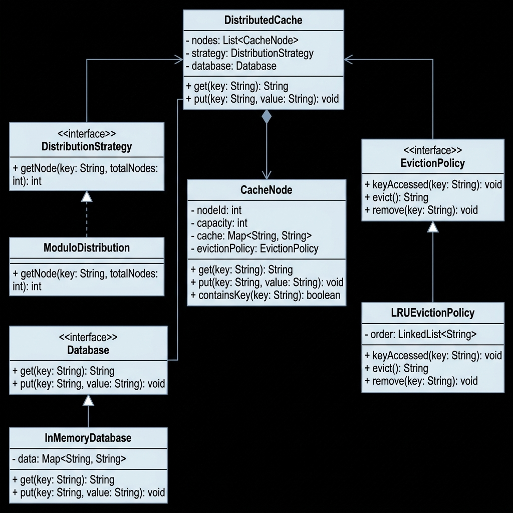

# Distributed Cache System

A low-level design implementation of a distributed cache that supports `get(key)` and `put(key, value)` operations across multiple cache nodes.

## Class Diagram



## How It Works

### Data Distribution Across Nodes

The system uses a `DistributionStrategy` interface to decide which cache node stores a given key. The current implementation is `ModuloDistribution`, which computes `hash(key) % numberOfNodes` to pick the target node. Since this is behind an interface, we can swap in a different strategy like consistent hashing without changing the rest of the code.

### Cache Miss Handling

When `get(key)` is called:
1. The distribution strategy determines which node should hold this key.
2. The system checks that node for the key.
3. If found (cache hit), the value is returned directly.
4. If not found (cache miss), the system fetches the value from the `Database`, stores it in the cache node, and then returns it.

### Eviction

Each `CacheNode` has a fixed capacity. When a node is full and a new key needs to be inserted:
1. The eviction policy picks a key to remove (in LRU, it removes the least recently used key).
2. The evicted key is removed from the cache.
3. The new key-value pair is then stored.

The `LRUEvictionPolicy` tracks access order using a `LinkedList`. Every time a key is accessed or inserted, it moves to the end of the list. When eviction is needed, the key at the front (least recently used) gets removed.

### Extensibility

The design uses interfaces at two key points:

- **DistributionStrategy** - Can be extended with consistent hashing, range-based routing, etc.
- **EvictionPolicy** - Can be extended with MRU, LFU, or any custom eviction logic.
- **Database** - The DB layer is also behind an interface, so it can be swapped from in-memory to an actual database.

## Project Structure

```
src/
├── Database.java              - Database interface
├── InMemoryDatabase.java      - In-memory DB implementation
├── DistributionStrategy.java  - Strategy interface for key routing
├── ModuloDistribution.java    - Hash modulo based routing
├── EvictionPolicy.java        - Eviction policy interface
├── LRUEvictionPolicy.java     - LRU eviction implementation
├── CacheNode.java             - Individual cache node
├── DistributedCache.java      - Main cache coordinator
└── Main.java                  - Demo / driver class
```

## How to Run

```bash
javac src/*.java -d out
java -cp out Main
```

## Sample Output

```
=== Testing GET (Cache Miss -> fetches from DB) ===
Cache MISS for key 'user1' on Node 1. Fetching from DB...
user1 = Alice
Cache MISS for key 'user2' on Node 2. Fetching from DB...
user2 = Bob
Cache MISS for key 'user3' on Node 0. Fetching from DB...
user3 = Charlie

=== Testing GET (Cache Hit) ===
Cache HIT for key 'user1' on Node 1
user1 = Alice
Cache HIT for key 'user2' on Node 2
user2 = Bob

=== Testing PUT ===
PUT key 'user6' -> Node 0
PUT key 'user7' -> Node 1

=== Testing Eviction (capacity = 2 per node) ===
PUT key 'user8' -> Node 2
Cache HIT for key 'user8' on Node 2
user8 = Heidi

=== Verifying evicted keys fall back to DB ===
Cache HIT for key 'user1' on Node 1
user1 = Alice
Cache MISS for key 'user4' on Node 1. Fetching from DB...
user4 = David
```

## Assumptions

- Keys are unique strings.
- The database interface is already available (simulated with `InMemoryDatabase`).
- No real network communication between nodes; this is an in-memory LLD exercise.
- When `put` is called, both the cache and the database are updated.
